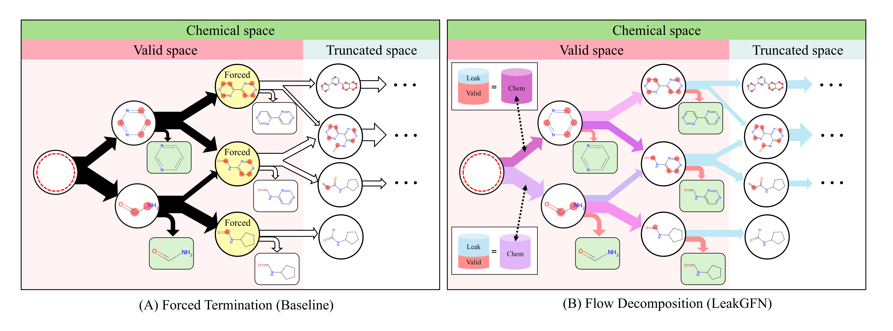

# LeakGFN

**Robust Molecular Generation in Generative Flow Networks via Flow Decomposition**

This repository contains the official implementation of LeakGFN, a dual-head GFlowNet architecture that addresses the flow leakage problem caused by trajectory truncation in molecular generation.

## Overview

Generative Flow Networks (GFlowNets) sample diverse molecules proportionally to a reward function. However, the vast chemical space necessitates truncating trajectory length, forcing models to treat incomplete molecular fragments as terminal states alongside valid molecules. This **flow leakage** distorts the learned distribution by allocating probability mass to chemically meaningless states.

**LeakGFN** solves this problem through flow decomposition:

- **Chemical Head** ($F_{\text{chem}}$): Models flow over the entire chemical space without truncation constraints
- **Valid Head** ($\lambda$): Estimates the fraction of flow reaching valid molecules within the truncation boundary
- **Valid Flow**: $F_{\text{valid}} = F_{\text{chem}} \cdot \lambda$ — used exclusively for sampling

The valid head implicitly learns molecular reachability through asymmetric terminal treatment, requiring **no explicit supervision**.

<p align="center">
  
</p>

## Key Features

- **Flow Decomposition**: Separates valid flow from leak flow to learn the correct distribution over accessible molecules
- **Implicit Reachability Learning**: The $\lambda$ head learns to predict reachability without explicit labels
- **Plug-and-Play**: Integrates seamlessly into existing GFlowNet frameworks (TacoGFN, HN-GFN, etc.)
- **Robustness**: Graceful degradation under varying $L_{\max}$ settings, unlike trajectory-level methods

## Requirements

- Python >= 3.8
- PyTorch >= 1.12
- torch-geometric
- torch-scatter
- RDKit
- NumPy
- Pandas
- PyYAML
- wandb (optional, for experiment tracking)

### Installation

```bash
# Clone the repository
git clone https://anonymous.4open.science/r/LeakGFN-464A
cd LeakGFN

# Create conda environment
conda env create --file conda_install.yaml

# Activate the environment
conda activate LeakGFN

# Install pip dependencies
pip install -r pip_requirement.txt
```

## Usage

### Training

Train LeakGFN on molecular optimization tasks:

```bash
# JNK3 kinase inhibition
python train.py --config_file ./configs/JNK3.yaml --seed 1 --log_dir ./checkpoints/LeakGFN/JNK3/seed_1

# GSK3β kinase inhibition
python train.py --config_file ./configs/GSK3B.yaml --seed 1 --log_dir ./checkpoints/LeakGFN/GSK3B/seed_1

# DRD2 activity
python train.py --config_file ./configs/DRD2.yaml --seed 1 --log_dir ./checkpoints/LeakGFN/DRD2/seed_1

# QED (drug-likeness)
python train.py --config_file ./configs/QED.yaml --seed 1 --log_dir ./checkpoints/LeakGFN/QED/seed_1

# SA (synthetic accessibility)
python train.py --config_file ./configs/SA.yaml --seed 1 --log_dir ./checkpoints/LeakGFN/SA/seed_1
```

### Reproducing Main Results (Table 1)

```bash
# Run all experiments with 3 seeds
bash train.sh
```

### Key Arguments

| Argument | Default | Description |
|----------|---------|-------------|
| `--config_file` | - | Path to YAML configuration file |
| `--seed` | 42 | Random seed for reproducibility |
| `--log_dir` | `./checkpoints` | Directory to save checkpoints and logs |
| `--num_iterations` | 30000 | Number of training iterations |
| `--max_blocks` | 8 | Maximum trajectory length ($L_{\max}$) |
| `--alpha` | 1.0 | Chemical flow loss weight |
| `--gamma` | 10 | Terminal loss coefficient |

## Results

### Single-Objective Molecular Optimization (Table 1)

| Method | JNK3 | GSK3β | DRD2 | QED | SA |
|--------|------|-------|------|-----|-----|
| GFN-FM | 0.403 | 0.716 | 0.775 | 0.926 | 0.922 |
| **LeakGFN (Ours)** | **0.653** | **0.760** | 0.829 | **0.926** | **0.923** |

*HM score (↑) averaged over 3 random seeds. LeakGFN achieves state-of-the-art on 4/5 tasks.*

### Robustness to $L_{\max}$ (Table 2, DRD2)

| Method | $L_{\max}$=6 | $L_{\max}$=8 | $L_{\max}$=10 | $L_{\max}$=12 |
|--------|--------------|--------------|---------------|---------------|
| GFN-DB | 0.926 | **0.934** | 0.136 | 0.096 |
| GFN-TB | 0.906 | 0.933 | 0.132 | 0.106 |
| **LeakGFN** | 0.865 | 0.797 | **0.517** | **0.435** |

*LeakGFN maintains reasonable performance at large $L_{\max}$ where trajectory-level methods collapse.*

## Project Structure

```
LeakGFN/
├── train.py                    # Main training script
├── configs/                    # Configuration files
│   ├── JNK3.yaml
│   ├── GSK3B.yaml
│   ├── DRD2.yaml
│   ├── QED.yaml
│   └── SA.yaml
├── gflownet/
│   ├── generator/
│   │   ├── leakgfn.py          # LeakGFN dual-head architecture
│   │   └── gfn.py              # Base GFlowNet
│   ├── oracle/                 # Molecular scoring oracles
│   ├── data/
│   │   └── blocks_105.json     # Fragment vocabulary (105 building blocks)
│   └── utils/
├── figures/
└── results.ipynb               # Results analysis
```

## Configuration

Key parameters in YAML config files:

```yaml
# LeakGFN-specific settings
alpha: 1.0              # Chemical flow loss weight (Eq. in paper)
gamma: 10               # Terminal loss coefficient

# GFlowNet settings  
min_blocks: 2           # Minimum trajectory length
max_blocks: 8           # Maximum trajectory length (L_max)
num_iterations: 30000

# Architecture
nemb: 256               # Hidden dimension
num_conv_steps: 8       # Message passing steps

# Reward shaping (task-specific)
reward_norm: 0.5        # Normalization constant
reward_exp: 8           # Reward exponent
```

## Citation

```bibtex
@inproceedings{leakgfn2026,
  title={LeakGFN: Robust Molecular Generation in Generative Flow Networks via Flow Decomposition},
  author={Hwanhee Kim, Seungyeon Choi, Sanghyun Park},
  booktitle={Proceedings of the 43rd International Conference on Machine Learning (ICML)},
  year={Accepted to ICML 2026}
}
```

## License

This project is licensed under the MIT License.

## Acknowledgements

This implementation builds upon the GFlowNet framework for molecular generation.
